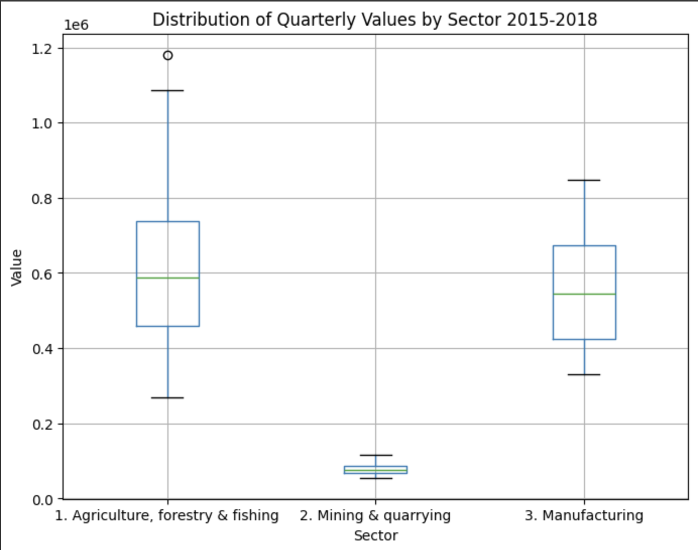
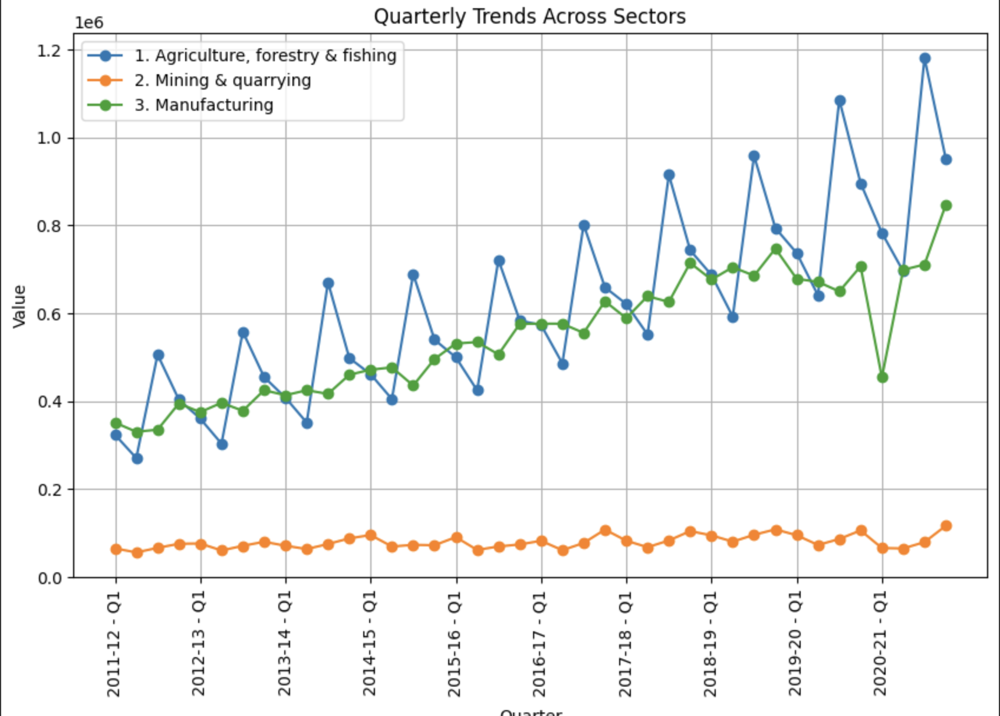
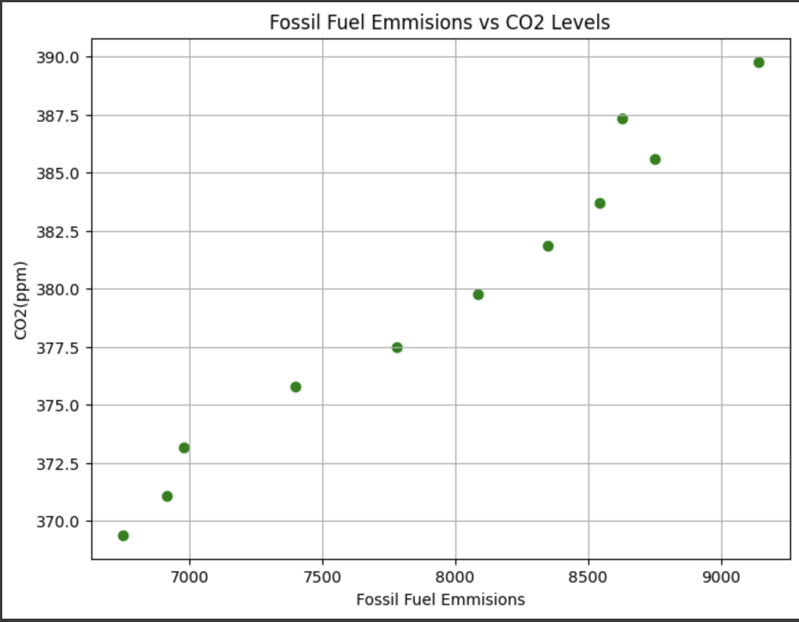

# DS 200 module 4 Visualizations
This project does visualizes data sourced from [Data.gov.in](https://data.gov.in).

## Quarterly value of different sectors from 2011 to 2021**

The dataset contains quarterly values of different sectors like Agriculture, manufacturing, mining etc.
We analyze how much each sector contributes across the quarters of the last three years

-The plot shows that Agriculture dominates over mining and manufacturing.

-Agriculture and manufacturing have similar medians but agriculture has higher variance.

-mining contributes the least but is also the most constant.

We also analyze how the sectors have evolved over the last decade.

-Agriculuture and manufacturing have grown while mining has remained constant.

-Agriculuture shows a repetitive pattern over the years.

## Average global temperature, C02 levels, Fossil fuel emissions**

The data set contains the average values for temperatures CO2 levels and fossil fuel emissions
We show the correlation of fossil fuel emissions with CO2 levels. _Go green_!

